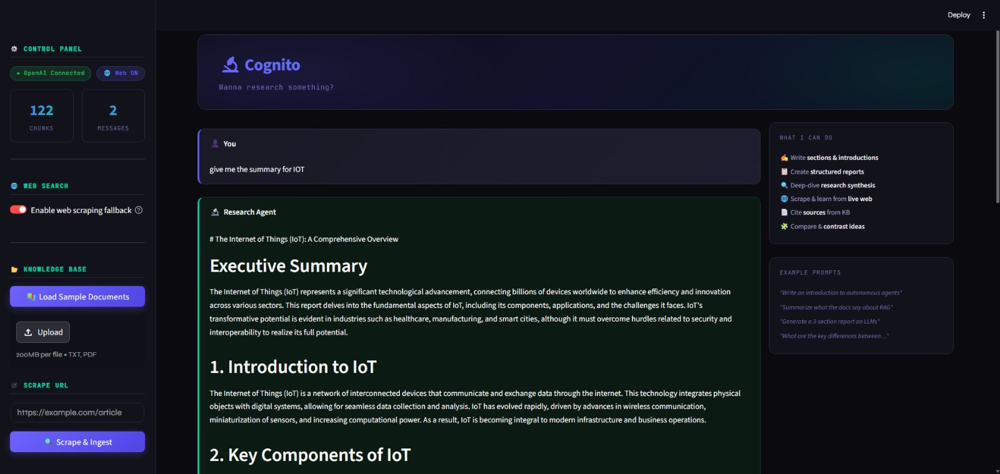

# 🔬 Autonomous Research Agent

A production-grade AI research assistant powered by **GPT-4o**, **ChromaDB**, and a **ReAct reasoning loop** — built to write sections, synthesise information, and generate structured reports, not just answer Q&A.

---
## Snapshot:

## ✨ What Makes This Different

| Old (Ollama / QA bot)          | New (GPT-4o / Research Agent)                        |
| ------------------------------ | ---------------------------------------------------- |
| Answers questions literally    | Understands intent — "write an intro" → writes prose |
| Single retrieval pass          | Iterative multi-query gathering                      |
| No writing ability             | Produces sections, reports, summaries                |
| HuggingFace embeddings (local) | OpenAI `text-embedding-3-small` (state-of-art)       |
| llama3.2 reasoning             | GPT-4o reasoning                                     |

---

## 🚀 Quick Start

### 1. Clone & install

```bash
git clone <your-repo>
cd autonomous_research_agent
pip install -r requirements.txt
```

### 2. Configure

```bash
cp .env.example .env
# Edit .env and add your OpenAI API key
```

`.env` minimum:

```
OPENAI_API_KEY=sk-your-key-here
```

### 3. Run

```bash
streamlit run app.py
```

---

## 📁 Project Structure

```
autonomous_research_agent/
├── app.py                    # Streamlit UI
├── requirements.txt
├── .env.example
├── data/
│   ├── chroma_db/            # Persistent vector DB (auto-created)
│   └── sample_docs/          # Demo knowledge base
│       ├── ai_intro.txt
│       ├── autonomous_agents.txt
│       └── rag_deep_dive.txt
└── src/
    ├── __init__.py
    ├── agent.py              # GPT-4o ReAct agent — the brain
    ├── ingestion.py          # TXT + PDF loader + chunker
    ├── retrieval.py          # Vector search with threshold filtering
    ├── scraper.py            # Web scraper with noise removal
    └── vectorstore.py        # ChromaDB + OpenAI embeddings wrapper
```

---

## 🧠 Agent Modes

| Mode                     | Best For                                               |
| ------------------------ | ------------------------------------------------------ |
| **Researcher** (default) | Writing sections, introductions, synthesis, deep dives |
| **Q&A**                  | Quick factual questions with concise answers           |
| **Report**               | Full structured documents with headings and sections   |

---

## ⚙️ Configuration

All settings via `.env`:

| Variable               | Default                  | Description                             |
| ---------------------- | ------------------------ | --------------------------------------- |
| `OPENAI_API_KEY`       | **required**             | Your OpenAI key                         |
| `OPENAI_MODEL`         | `gpt-4o`                 | Model to use (`gpt-4o-mini` is cheaper) |
| `OPENAI_EMBED_MODEL`   | `text-embedding-3-small` | Embedding model                         |
| `AGENT_MAX_ITERATIONS` | `10`                     | ReAct loop max cycles                   |
| `AGENT_MAX_TOKENS`     | `3000`                   | Max tokens per response                 |
| `SIMILARITY_THRESHOLD` | `0.6`                    | Cosine distance cutoff for retrieval    |
| `CHUNK_SIZE`           | `1000`                   | Characters per chunk                    |
| `CHUNK_OVERLAP`        | `200`                    | Overlap between chunks                  |

---

## 💡 Example Prompts

- _"Write an introduction section about autonomous agents"_
- _"Summarise the key differences between RAG approaches described in the documents"_
- _"Generate a structured report on the current state of AI, covering foundations, agents, and RAG"_
- _"What are the main failure modes of RAG systems and how do you fix them?"_
- _"Compare goal-based agents vs utility-based agents"_

---

## 🏗️ How It Works

```
User Prompt
    ↓
GPT-4o analyses intent
    ↓
THOUGHT → what do I need to write this well?
ACTION  → query_knowledge_base("specific angle")
OBSERVATION → relevant chunks returned
    ↓ (repeat 2-5x with different queries)
THOUGHT → I have enough material. Planning structure.
FINAL_ANSWER → well-written prose with inline citations
    ↓
Streamlit displays response + source chips
```

---

## 📦 Dependencies

- `streamlit` — UI
- `openai` — GPT-4o + embeddings
- `chromadb` — vector database
- `langchain` / `langchain-core` — text splitting + Document schema
- `pymupdf` — PDF reading
- `beautifulsoup4` + `requests` — web scraping
- `python-dotenv` — env config
- `tiktoken` — tokeniser

---

## 🔒 Cost Estimate

| Operation                     | Model                  | Approx Cost |
| ----------------------------- | ---------------------- | ----------- |
| 1 chat turn (researcher mode) | GPT-4o                 | ~$0.01–0.05 |
| Embedding 100 chunks          | text-embedding-3-small | ~$0.002     |
| Full report generation        | GPT-4o                 | ~$0.05–0.15 |

Switch to `gpt-4o-mini` in `.env` to reduce costs by ~20x with slight quality reduction.
